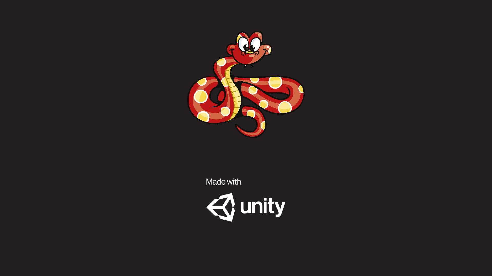
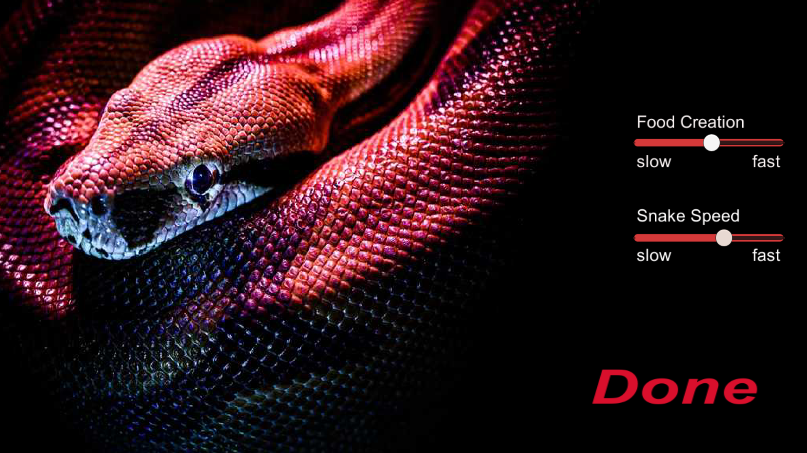
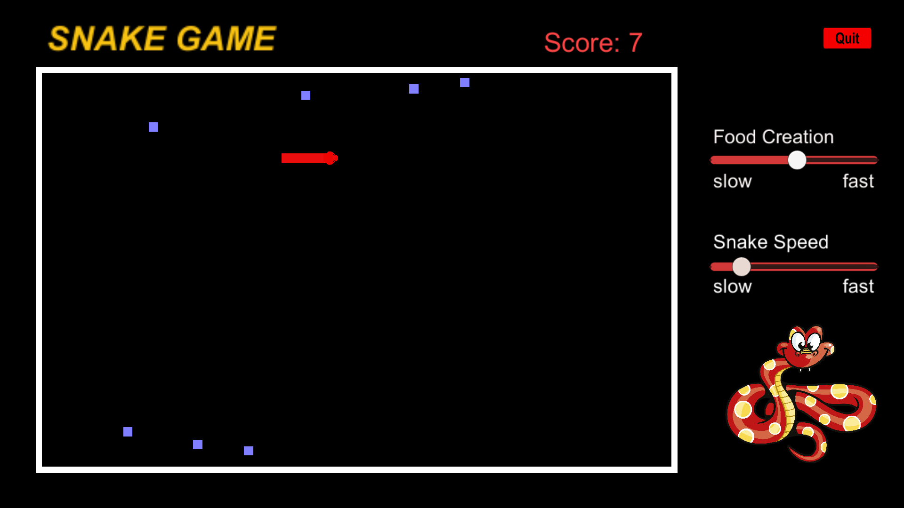
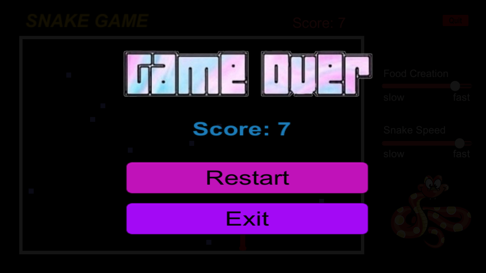

# Snake Game - Unity

## Overview

Welcome to the Snake Game built using Unity engine and coded in C#. This classic Snake game brings back the nostalgia of the original while incorporating modern design and functionality. Navigate the snake, grow longer, and try to achieve the highest score possible!

## Contents

- **codes:** Contains all the code files required for the game. all cs files are in codes/Assests/Scripts
  - `MenuScript.cs`: Handles the game menu functionality.
  - `GameOverScreenScript.cs`: Manages the game over screen.
  - `ScoreScript.cs`: Tracks and updates the player's score.
  - `Snake.cs`: Implements the snake behavior.
  - `SpawnFood.cs`: Manages the spawning of food items.
  - `SS.cs`: Extended/helper Snake behavior.

- **build:** Contains the executable application and necessary DLL files to run the game.

---

## How to Run

Follow the steps below to run the Snake Game:

1. **Clone the Repository:**
   ```
   git clone https://github.com/manisha-v/snake-game.git
   cd snake-game
   ```

2. **Open Unity:**
   - Open Unity Hub and add the project by selecting the folder.

3. **Run the Game:**
   - Open the main scene.
   - Press the play button in the Unity Editor to run the game.

5. **Or just Run the Executable:**
   - Present in the folder `build`.
   - Run the provided executable file (`SnakeGameUpdated.exe`) to play the game.

6. **Enjoy:**
   - Control the snake using the arrow keys and try to eat as much food as possible without colliding with the walls or yourself.

## Preview

Let's get started



Game Menu - Play, Settings, and Exit


On clicking Settings - we see this screen to change the food spawn rate and snake speed



On Clicking Play - we see this screen. Navigate the snake, grow longer, and try to achieve the highest score possible!



And the final Game over screen



**Have fun playing the Snake Game! 🐍**

## Need any help?
##### Connect me on [LinkedIn](https://www.linkedin.com/in/manisha-varshney-914646191/)   

Thank you for exploring our Android app development repository! If you have any questions or feedback, please don't hesitate to reach out.
